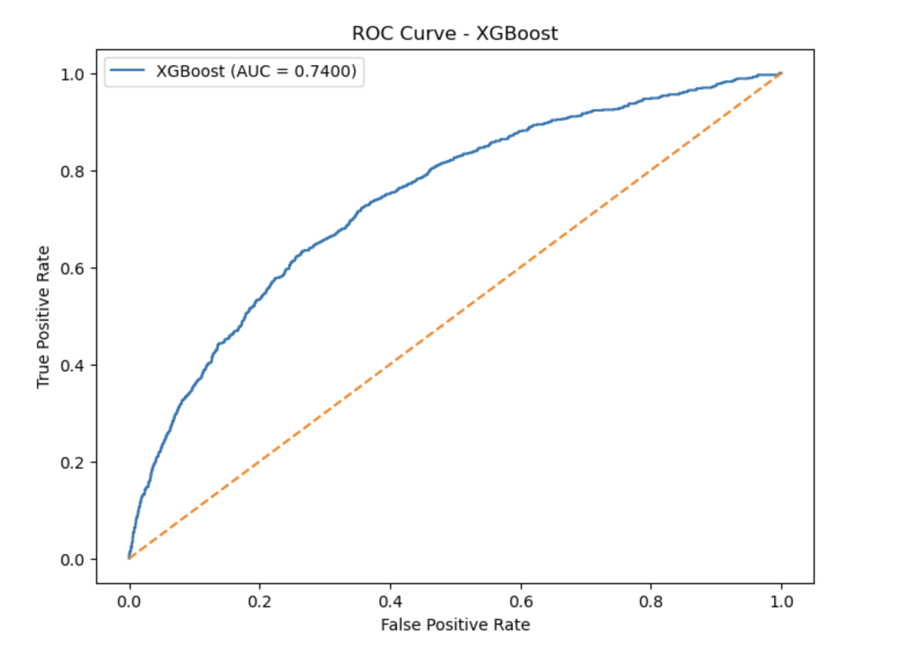
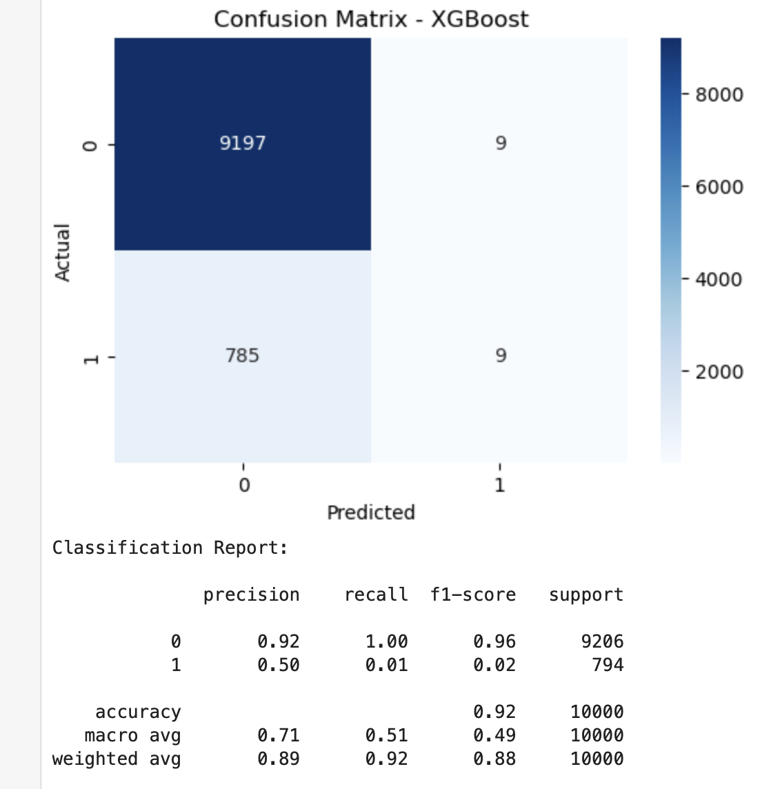
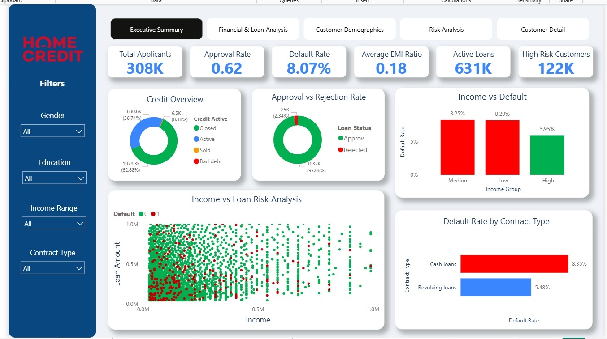
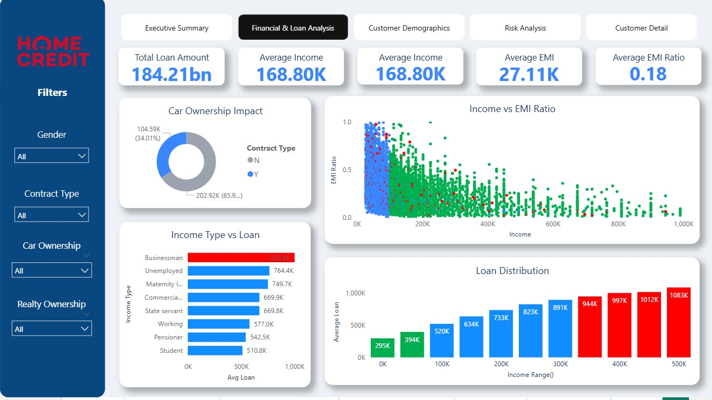
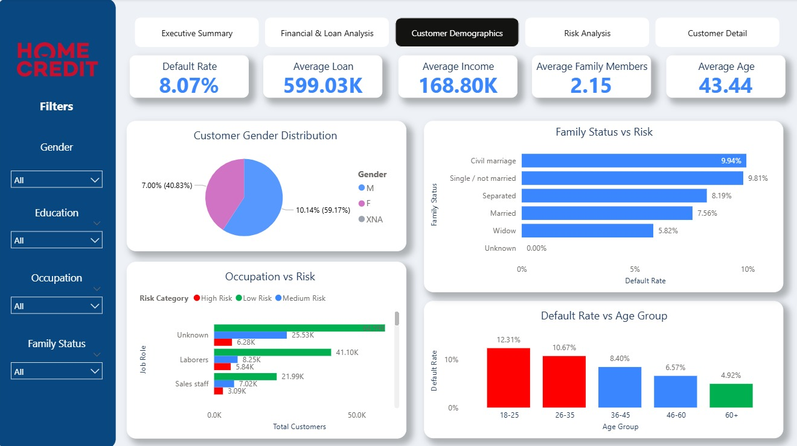
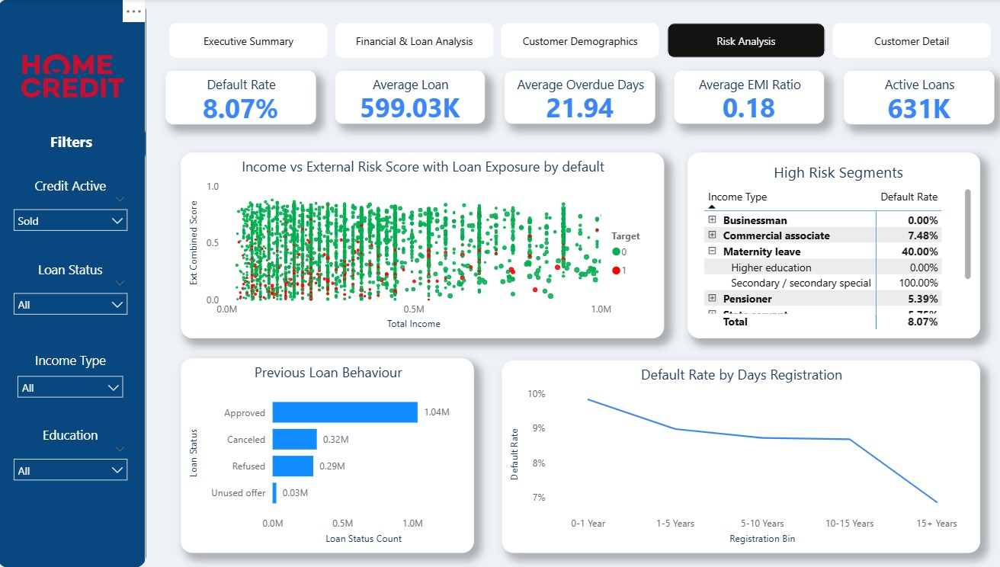
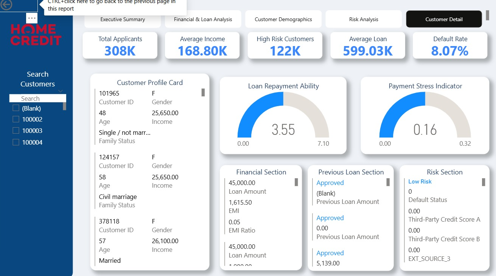

# Home Credit Default Risk Prediction

## Project Overview

This project focuses on predicting customer loan default risk using Machine Learning techniques and interactive Power BI dashboards. The goal is to help financial institutions identify high-risk customers and make better lending decisions.


## Business Problem

Financial institutions face significant losses due to loan defaults. This project aims to analyze customer financial behavior and build predictive models to identify customers who are likely to face repayment difficulties.

---

## Objectives

- Analyze customer financial data
- Identify patterns related to loan defaults
- Build machine learning models for risk prediction
- Create interactive dashboards for business insights
- Improve decision-making using data analytics

---

## Dataset Information

Dataset: Home Credit Default Risk Dataset

The dataset contains:
- Customer demographic details
- Loan information
- Credit history
- Income details
- Employment information
- Payment behavior

---

## Technologies Used

### Programming & Analysis
- Python
- Pandas
- NumPy

### Data Visualization
- Matplotlib
- Seaborn
- Power BI

### Machine Learning
- Scikit-learn
- XGBoost

### Development Tools
- Jupyter Notebook
- GitHub

---

## Project Workflow

### 1. Data Collection
- Imported Home Credit dataset
- Verified dataset structure
- Checked missing values

### 2. Data Cleaning
- Handled missing values
- Removed duplicate records
- Corrected data inconsistencies

### 3. Exploratory Data Analysis (EDA)
- Customer income analysis
- Loan distribution analysis
- Default pattern identification
- Correlation analysis

### 4. Feature Engineering
- Created new features
- Encoded categorical variables
- Feature scaling

### 5. Machine Learning Modeling
Implemented multiple machine learning algorithms:
- Logistic Regression
- Decision Tree Classifier
- Random Forest Classifier
- Ada Boost Classifier
- Gradient Boost Classifier
- Support Vector Machine (SVC)
- K-Nearest Neighbors Classifier(KNN)
- XGBoosting Classifier

### 6. Model Evaluation
Evaluated models using:
- Accuracy Score
- ROC-AUC Score
- Confusion Matrix
- Precision & Recall

### 7. Dashboard Development
Built an interactive Power BI dashboard for business insights and storytelling.

---

## Machine Learning Models Used

| Model | Purpose |
|-------|---------|
| Logistic Regression | Baseline classification model |
| Decision Tree | Rule-based classification |
| Random Forest | Ensemble learning model |
| XGBoost | Advanced boosting model |

---

## Model Performance

### ROC Curve



---

### Confusion Matrix



---

### Feature Importance


---

## Power BI Dashboard

### Dashboard Screenshot







---

## Dashboard Insights

Key insights identified from the dashboard:

- High-risk customers were identified based on income and credit history
- Customers with lower income showed higher default probability
- Loan type and employment status significantly affected repayment behavior
- Certain customer segments had higher risk patterns

---

## Key Business Recommendations

- Improve risk assessment for low-income customers
- Monitor customers with poor credit history
- Introduce targeted repayment strategies
- Strengthen customer credit evaluation processes

---

## Project Structure

```bash
home-credit-default-risk/
│
├── data/
│
├── notebooks/
│   └── Home_Credit_Risk_Analysis.ipynb
│
├── images/
│   ├── dashboard.png
│   ├── roc_curve.png
│   ├── confusion_matrix.png
│   ├── feature_importance.png
│   ├── Executive_Summary.png
│   ├── Financial_And_Loan_Analysis.png
│   ├── Customer_Demogrphics.png
│   ├── Risk_Analysis.png
│   └── Customer_Details.png
│
├── dashboard/
│   └── powerbi_dashboard.pbix
│
├── models/
│   └── best_xgb_model.pkl
│
├── app.py
│
├── requirements.txt
│
└── README.md
```

---

## Installation

Clone the repository:

```bash
git clone https://github.com/yourusername/home-credit-default-risk.git
```

Install required libraries:

```bash
pip install -r requirements.txt
```

Run Jupyter Notebook:

```bash
jupyter notebook
```

---

## Future Improvements

- Deploy model using Streamlit
- Real-time prediction system
- Advanced feature engineering
- Hyperparameter tuning
- Deep learning implementation

---

## Connect With Me

### LinkedIn
www.linkedin.com/in/arun-p-c

### GitHub
https://github.com/pcarun8

---

## Project Status

Completed ✅
